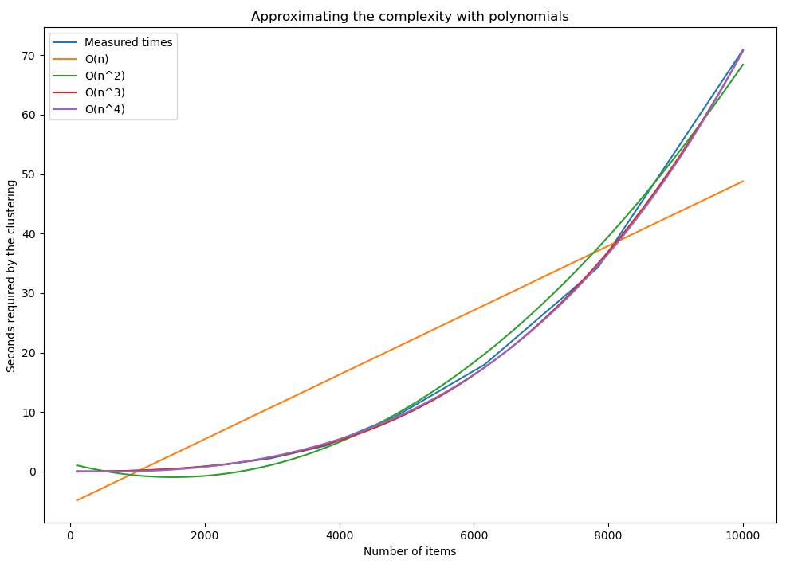

# Robust Single-Linkage Clustering

*Robust Single-Linkage Clustering* is a robust variant of hierarchical
clustering with a single-linkage merging function. The single-linkage strategy
merges two clusters based on the minimum distance between any item in one
cluster to any item in the other cluster. The advantage of single-linkage is
that it is able to capture non-spherical clusters. The main downside is that it
is really prone to capture outliers, i.e., items (or small groups of items) so
far away from all other items that they create their own clusters, which stops
single-linkage for finding the desired clusters, unless the number of clusters
is quite large. RSLC mitigates this issue with small outlier clusters by
restricting the minimum size of the clusters.

To do this the clusters are created "top-down", by splitting clusters, rather
than "bottom-up", by merging clusters. To do this we first need to recognise the
connection between single-linkage and minimal spanning trees in graphs. If you
remove the *k-1* largest edges in a minimal spanning tree you get *k*
disconnected subtrees, or clusters. Thus, by turning the distances between the
items into a fully connected graph the "Reverse-delete algorithm" for finding a
minimal spanning tree can be used for single-linkage clustering, as long as we
modify the algorithm to allow disconnected subtrees.

Furthermore, to make the algorithm more robust towards outliers we want to avoid
too small clusters. After every edge removal we check if a new cluster is
created. If the new cluster is smaller than a threshold then we can mark the
items in that cluster as outliers and re-add the edge (just like how
reverse-delete usually avoids new clusters).

## Pseudocode

```{pseudocode}
Create an undirected fully connected graph G<N, E>,
  where the weights of the edges in E are the distances between the items (nodes) in N.
Sort E in descending order.
For each edge e in E:
    Remove e from E.
    If this splits a subgraph into two disconnected subgraphs G1 and G2:
        If |G1| < min_size:
            Add e to E.
            mark every node n in G1 as an outlier.
        If |G2| < min_size:
            Add e to E.
            mark every node n in G2 as an outlier.
        If the desired number of disconnected subgraphs in G is reached:
            Return the disconnected subgraphs in G as clusters.
```

## Complexity

There are `|E| = n * (n + 1) / 2` edges in the graph, where `n` is the number of
items, so sorting the edges is `O(n^2 log(n))`. Looping through the edges takes
`O(n^2)` and checking for subgraphs takes at most `O(n^2)`. This suggest a total
complexity of `O(n^4)` which is quite horrible, but in practise it will probably
be closer to `O(n^3)` since the whole graph doesn't have to be evaluated in
order to check for disconnected subgraphs.

By running the algorithm on different sized datasets and measuring the time we
can fit polynomials to approximate the complexity. Here we can see that the
third and fourth degree polynomials are almost identical and almost perfectly
match the measured times, which suggests that `O(n^3)` might indeed be the real
complexity (although I currently don't have a proof for that).



This also shows that on a modern machine RSLC with datasets up to a size of 5000
is suitable for interactive use. Note that the time measured here only considers
RSLC, things like calculating the distance matrix takes additional time.

## Installation

To use the algorithm in Rust add `rslc = { git = "https://github.com/Aggrathon/rslc/" }`
under `[dependencies]` in your `Cago.toml`.

There are also API bindings for [Python](python/) and [R](R/) in respective
subdirectories.
